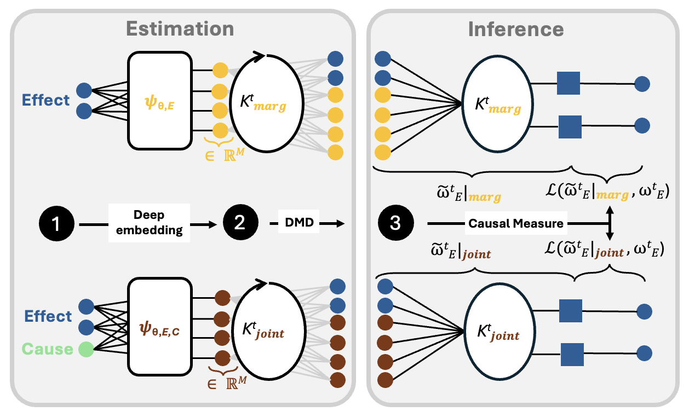

Kausal
=========


🚧 **Kausal** is a Python package to perform causal inference in nonlinear, high-dimensional dynamics using deep Koopman operator-theoretic approach.

<div align="center">
  <a href="https://arxiv.org/abs/2505.14828"></a>
</div>
</br>



# Abstract
We use a deep Koopman operator-theoretic formalism to develop a novel causal discovery algorithm, Kausal. Causal discovery aims to identify cause-effect mechanisms for better scientific understanding, explainable decision-making, and more accurate modeling. Standard statistical frameworks, such as Granger causality, lack the ability to quantify causal relationships in nonlinear dynamics due to the presence of complex feedback mechanisms, timescale mixing, and nonstationarity. This presents a challenge in studying many real-world systems, such as the Earth's climate. Meanwhile, Koopman operator methods have emerged as a promising tool for approximating nonlinear dynamics in a linear space of observables. In Kausal, we propose to leverage this powerful idea for causal analysis where optimal observables are inferred using deep learning. Causal estimates are then evaluated in a reproducing kernel Hilbert space, and defined as the distance between the marginal dynamics of the effect and the joint dynamics of the cause-effect observables. Our numerical experiments demonstrate Kausal's superior ability in discovering and characterizing causal signals compared to existing approaches of prescribed observables. Lastly, we extend our analysis to observations of El Niño-Southern Oscillation highlighting our algorithm's applicability to real-world phenomena. 

# Installation
> __NOTE__: Since the package is still under review and in active development, we recommend cloning the repository for an early view. Published work will provide an easy installation through `PyPi` hosting, for example.

```
git clone https://github.com/juannat7/kausal.git
```

# Quickstart Guide
> __NOTE__: Please refer to our example notebooks (in `examples/`) for demonstration!


`Kausal` provides an interface to perform causal analysis based on Koopman operator theory, between two set of multivariate timeseries:

```python
import torch
from kausal import koopman

# Define your cause/effect variables
cause = torch.tensor(...)  # Shape (n_features, *, n_timestep)
effect = torch.tensor(...) # Shape (n_features, *, n_timestep)

# Initialize `Kausal` object
model = koopman.Kausal(
    cause = cause,
    effect = effect
)

# Estimate causal effect
causal_effect = model.evaluate(
    time_shift = 1
)
```

You can also specify specific observable functions, e.g., `MLP` or `CNN`.
```python
from kausal.observables import MLPFeatures

model = koopman.Kausal(
    marginal_observable = MLPFeatures(...),
    joint_observable = MLPFeatures(...),
    cause = ...,
    effect = ...
)
```

Several regression techniques to estimate the Koopman operator is also provided, e.g., pseudo-inverse (`PINV`) or low-rank dynamic mode decomposition (`DMD`).
```python
from kausal.regressors import DMD

model = koopman.Kausal(
    regressor = DMD(svd_rank = 4),
    cause = ...,
    effect = ...
)
```
# Citation
If you find any of the code and dataset useful, feel free to acknowledge our work through:

```bibtex
@article{nathaniel2025deepkoopmanoperatorframework,
  title={Deep Koopman operator framework for causal discovery in nonlinear dynamical systems},
  author={Juan Nathaniel and Carla Roesch and Jatan Buch and Derek DeSantis and Adam Rupe and Kara Lamb and Pierre Gentine},
  journal={arXiv preprint arXiv:2505.14828},
  year={2025}
}

@article{rupe2024causal,
  title={Causal Discovery in Nonlinear Dynamical Systems using Koopman Operators},
  author={Rupe, Adam and DeSantis, Derek and Bakker, Craig and Kooloth, Parvathi and Lu, Jian},
  journal={arXiv preprint arXiv:2410.10103},
  year={2024}
}
