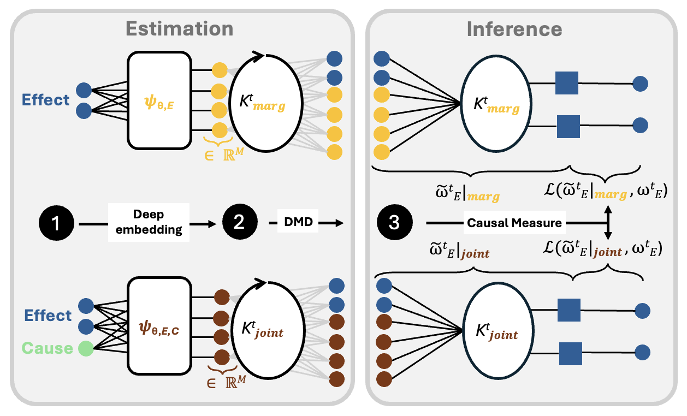

Kausal: Deep Koopman Operators for Causal Discovery
=========

**Kausal** is a PyTorch package to perform causal inference in nonlinear, high-dimensional dynamics using deep Koopman operator-theoretic approach.

<div align="center">
  <a href="https://arxiv.org/abs/2505.14828"></a>
</div>
</br>



# Features
- 🌡️ Causal measures between high-dimensional, multi-scale, nonlinear timeseries
- ⌛ Uncertainty quantification of causal measures
- 🌐 Causal graph discovery


# Abstract
Causal discovery aims to identify cause-effect mechanisms for better scientific understanding, explainable decision-making, and more accurate modeling. Standard statistical frameworks, such as Granger causality, lack the ability to quantify causal relationships in nonlinear dynamics due to the presence of complex feedback mechanisms, timescale mixing, and nonstationarity. Thus, applying these methods to study causal dynamics in real-world systems, such as the Earth, is a major challenge. Addressing this shortcoming, we leverage deep learning and a **K**oopman operator-theoretic formalism to present a new class of c**ausal** discovery algorithms. **Kausal** uses deep Koopman operator methods to approximate nonlinear dynamics in a linearized vector space in which traditional causal inference methods such as Granger causality can be more easily applied. Our idealized experiments demonstrate **Kausal**'s superior ability in discovering and characterizing causal signals compared to existing deep learning and non-deep learning state-of-the-art approaches. Finally, the successful identification of major El Niño and La Niña events in observations showcases **Kausal**'s skill to handle real-world applications.

# Installation

Kausal is available on PyPi, so installation is as easy as:

```
pip install kausal
```

If you use conda, please use the following commands:
```
conda create --name venv python=3.10
conda activate venv
pip install kausal
```

# Quickstart Guide

Please refer to our tutorial notebooks in the `tutorial/` folder for demonstration.

# Experimental Results
You can find accompanying code to reproduce the experimental results in the `experiments/` folder.

# Developer's Guide
We welcome and appreciate any contribution to improve the codebase! You can make a Pull Request or raise an Issue. During development, install the package in the editable format:

```
git clone https://github.com/juannat7/kausal.git
cd kausal/
pip install -e .

```

# Citation
If you find any of the code and dataset useful, feel free to acknowledge our work through:

```bibtex
@article{nathaniel2025deepkoopmanoperatorframework,
  title={Deep Koopman operator framework for causal discovery in nonlinear dynamical systems},
  author={Juan Nathaniel and Carla Roesch and Jatan Buch and Derek DeSantis and Adam Rupe and Kara Lamb and Pierre Gentine},
  journal={arXiv preprint arXiv:2505.14828},
  year={2025}
}

@article{rupe2024causal,
  title={Causal Discovery in Nonlinear Dynamical Systems using Koopman Operators},
  author={Rupe, Adam and DeSantis, Derek and Bakker, Craig and Kooloth, Parvathi and Lu, Jian},
  journal={arXiv preprint arXiv:2410.10103},
  year={2024}
}
